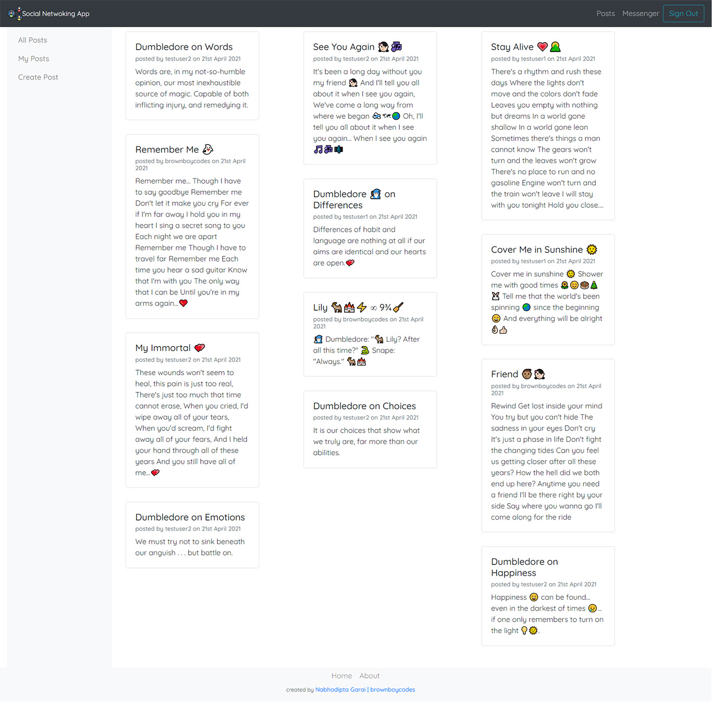
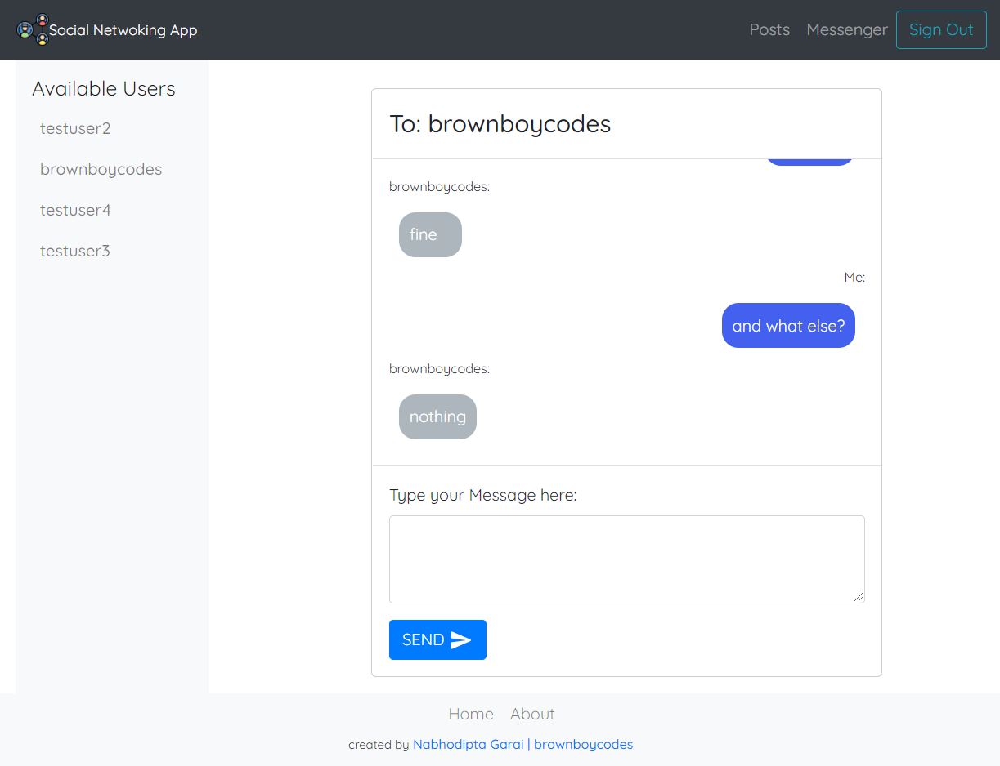

# **Social Networking App by brownboycodes**

---

This is a minimalistic social networking app
This app enables users to create and publish posts and message other users

People who wish to use these features first need to create an account
This is a demo app so everyone is requested not to use their real email accounts, since important mechanisms like email id verification and password reset has not been included

Technologies being used on the Frontend:

    1. React as the frontend framework
    2. React Bootstrap and Bootstrap for implementing prebuilt CSS
    3. React-Query has been used for asynchronous data management
    4. Redux for state management of components
    5. client-side SocketIO for realtime data integration
    6. Formik and Yup has been used for input form management and form validation
    7. Notyf for showing notifications
    8. Google Fonts

Technologies being used on the Backend:

    1. Express and NodeJS for backend
    2. SocketIO is being used for realtime data transfer
    3. NeDB is being used for databases
    4. passport-js, express-session and bcrypt is being used user authentication

---

## Landing Page

---

---
## page containing all Posts

---

---
## chat messenger

---

---

    To build the clientside of the application run:

    `npm run heroku-postbuild`

    To start the application in production mode run:

    `npm run start`
    
    To start the application in development mode run:
    
    `npm run startDev`

---

created by [brownboycodes](https://brownboycodes.herokuapp.com/)
